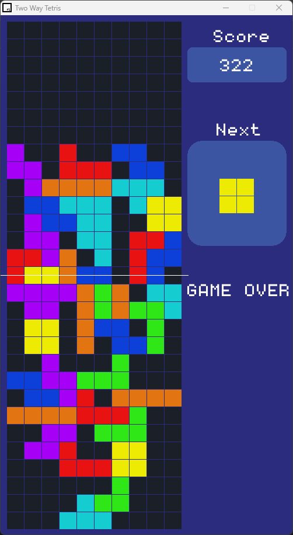

# C++ Two Way Tetris Game using raylib

This GitHub repository is modified version of the classic game of tetris in which the blocks fall from top and bottom with a center meeting point with the C++ programming language and the raylib library.

# Project Preview

  

# Acknowledgement

The GitHub repository has taken most of the code from the Github repo - <a href='https://github.com/educ8s/Cpp-Tetris-Game-with-raylib'>Link</a>.

All copyrights and acknowledgement go to <a href='https://github.com/educ8s'>Nick Koumaris</a>.
